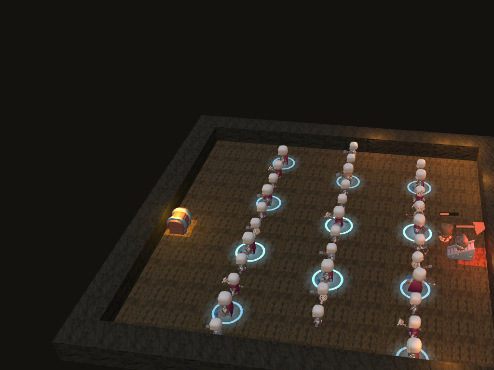
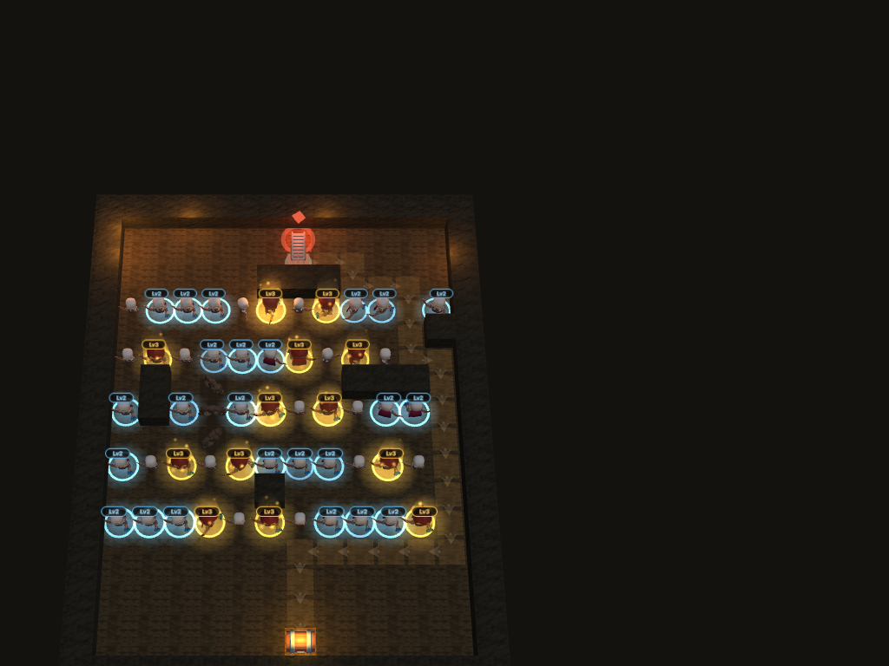

# Dungeon Warden

> 모험가가 아니라, 던전이 되어라.

스켈레톤 타워를 세워 방을 미로로 만들고, 끝없이 밀려오는 모험가를 막아내는 3D 타워디펜스입니다.
Verse8(Agent8) 플랫폼 배포용으로 만들었고, 브라우저에서 바로 돌아갑니다.



## 어떤 게임인가

방은 처음부터 뚫려 있고, **플레이어가 세운 타워가 곧 벽**입니다. 입구에서 코어까지 가는 길을
막아버릴 수는 없기 때문에, 길을 최대한 길고 꼬불꼬불하게 만드는 것이 이 게임의 핵심입니다.

- 웨이브는 자동으로 시작하지 않고, 플레이어가 버튼을 눌러야 들어옵니다.
- 웨이브 5개를 막으면 스테이지가 하나 올라가고, 적은 계속 강해집니다. 목숨이 다하면 그 판은 끝.
- 판이 끝나면 돌파한 스테이지 수만큼 **영혼**을 받고, 영혼으로 영구 강화(연구)를 삽니다.
- 도달한 스테이지가 랭킹에 올라갑니다.



## 주요 기능

**빌드**
- 타워 7종 — 궁수, 메이지, 방패병, 졸개, 석궁수, 광전사, 주술사. 각각 단일 공격 / 범위 / 둔화 /
  저가 연사 / 장거리 저격 / 주변 전체 공격 / 주변 타워 공속 버프를 맡습니다.
- 함정 7종 — 가시, 화살, 낙석, 화염, 거미줄, 독 웅덩이, 되돌림 룬. 바닥 함정은 지나가는 적마다
  한 번씩 발동하고, 화살 함정만 주기적으로 쏩니다.
- 타워는 Lv3까지 강화되고, 레벨이 오르면 **외형이 바뀝니다**: Lv1 무기 → Lv2 망토와 왼손 장비 +
  푸른 오라 → Lv3 투구·모자와 큰 장비 + 금빛 뼈와 빛기둥.

**판마다 달라지는 방**
- 바위 기둥과 잔해가 매 판 새로 배치됩니다. 모든 바닥이 갇히지 않도록 검증한 배치만 나옵니다.
- 미로만이 정답이 되지 않게, 스테이지 2부터는 **미로를 무시하고 날아오는 새끼 드래곤**이 섞여
  나옵니다. 바닥 함정도 통하지 않아 타워와 화살 함정으로 잡아야 합니다.
- 각 스테이지 마지막 웨이브에는 챔피언(보스)이 오고, 화면 상단 중앙에 보스 체력바가 뜹니다.

**그 외**
- 5개 언어(한국어 · English · 日本語 · 简体中文 · 繁體中文), 언어별 디스플레이 폰트 서브셋 생성.
- 배속 1×/2×(무료), 3×(상점 판매 항목), 한 판에 한 번 보는 보상형 광고(골드 +50).
- 랭킹, 연구, 게임 설명, 설정, 튜토리얼.

## 기술 스택

| 영역 | 사용 기술 |
|---|---|
| 클라이언트 | React 18, TypeScript 5.6, Vite 8 |
| 렌더링 | three.js 0.185 (glTF 모델, 인스턴싱, 오프스크린 아이콘 베이킹) |
| 서버 | Verse8/Agent8 `server.js` (샌드박스 실행, 상태 · 랭킹 · 검증) |
| 테스트 | Vitest (53개), 시뮬레이션 봇 기반 밸런스 측정 |

## 구조에서 신경 쓴 것

**시뮬레이션과 렌더링의 분리**
`src/game/td/StageRun.ts`가 게임 규칙 전부(경로 탐색, 타워 사격, 함정, 웨이브, 골드, 목숨)를
들고 있고, DOM도 three.js도 모릅니다. 고정 타임스텝(0.05초)으로 돌기 때문에 테스트에서도
브라우저에서도 결과가 같습니다. 렌더러는 이 상태를 그리기만 합니다.

**봇으로 재는 밸런스**
`tests/td-bot.ts`에 미로를 짓는 봇(지그재그 / 탐욕적 / 길가 배치)이 있습니다. 수치를 바꾸면
봇을 수십 판 돌려 "몇 스테이지에서 끝나는지"로 확인합니다. 새 타워를 넣을 때도, 랜덤 맵이
너무 불공평하지 않은지 볼 때도 같은 방법을 씁니다.

**클라이언트를 믿지 않는 부분만 서버로**
판 안의 골드처럼 저장되지 않는 값은 클라이언트가 계산합니다. 반면 기록과 영혼은 서버가
가집니다. `server.js`는 웨이브 규칙을 따로 들고 있다가, 보고된 웨이브 수가 물리적으로 가능한
시간 안에 나왔는지 확인하고(`RUN_TOO_FAST`), 중간에 꺼진 판도 마지막 체크포인트까지 정산합니다.

**에셋 파이프라인**
모델과 사운드는 폴더에 넣고 `npm run assets`로 매니페스트를 만듭니다. 런타임은 파일명을
정규식으로 찾기 때문에, 팩이 바뀌어도 코드가 깨지지 않습니다. `scripts/optimize-models.mjs`는
모델을 quantize · meshopt 압축하고, `scripts/build-fonts.mjs`는 실제로 쓰는 글자만 남긴
디스플레이 폰트를 굽습니다.

## 실행

```bash
npm install
npm run dev        # 개발 서버
npm test           # 테스트 53개
npm run typecheck  # 타입 검사
npm run build      # 배포 빌드
npm run assets     # 에셋 매니페스트 다시 생성
```

## 폴더

```
src/game/td/        게임 규칙 (StageRun, 타워, 적, 스테이지 생성, 연구)
src/game/sim/       경로 탐색과 함정 수치
src/game/assets/    모델 로딩, 레벨별 장비, 아이콘 베이킹
src/game/DungeonRenderer.ts   three.js 렌더러
src/ui/             다이얼로그와 UI 부품
src/i18n/           5개 언어 문자열
server.js           Verse8 서버 함수 (진행도 · 랭킹 · 검증)
tests/              시뮬레이션 · 서버 · 밸런스 봇 테스트
docs/design/        설계 노트
```

## 에셋 출처

모두 CC0(퍼블릭 도메인) 또는 오픈 폰트 라이선스입니다.

- 모델: [KayKit](https://kaylousberg.itch.io) (던전, 스켈레톤, 모험가),
  [Quaternius](https://poly.pizza/m/VBvzjFIYws) (드래곤)
- 사운드: [OpenGameArt](https://opengameart.org) — rubberduck, artisticdude 외
  (자세한 목록은 `public/assets/audio/SOURCE.md`)
- 폰트: Cinzel, Hahmlet, Zen Antique, Noto Serif SC/TC (SIL OFL), Pretendard
